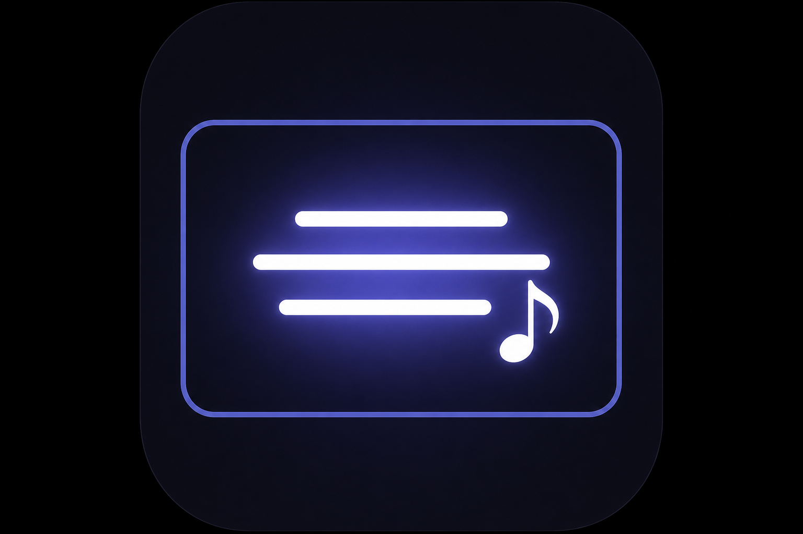
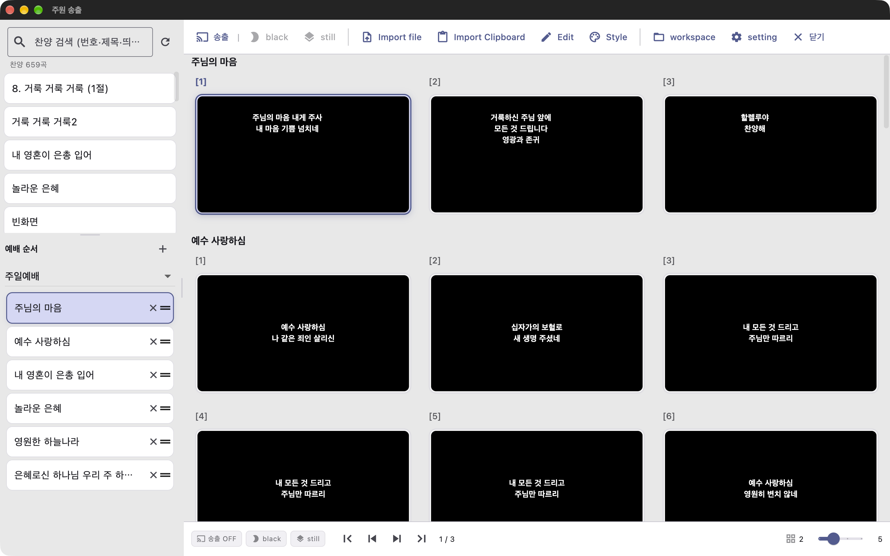
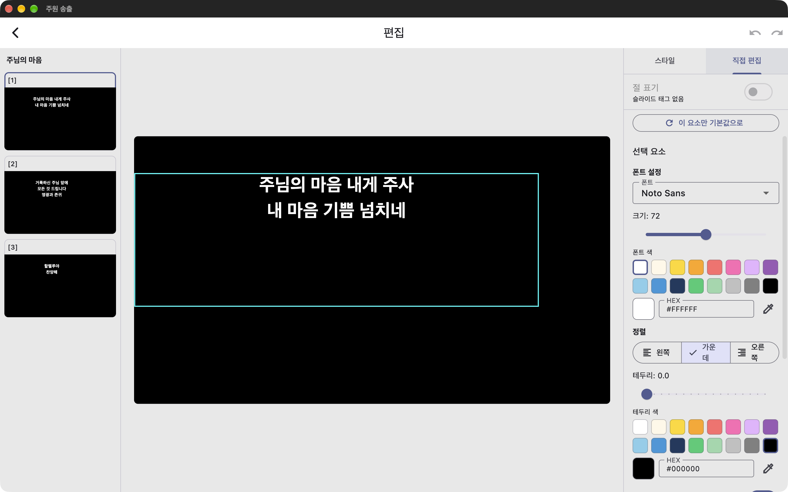
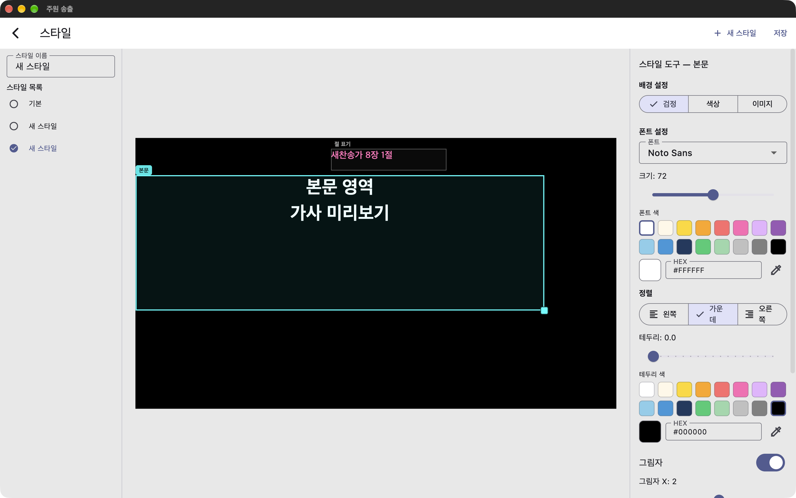
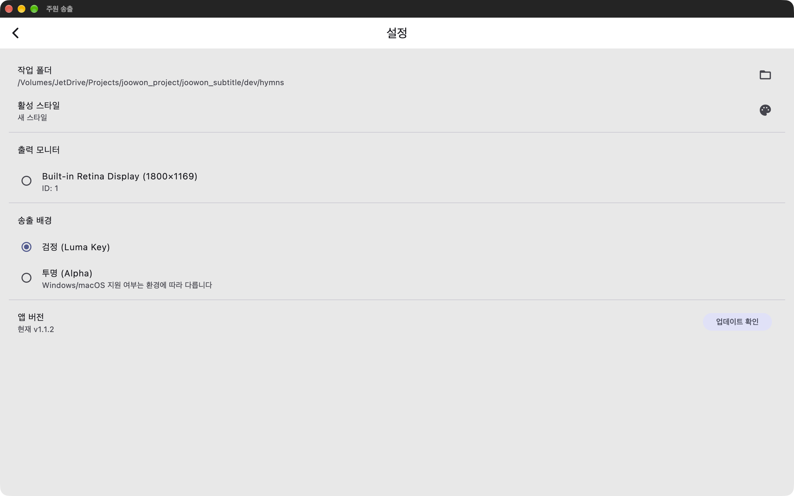
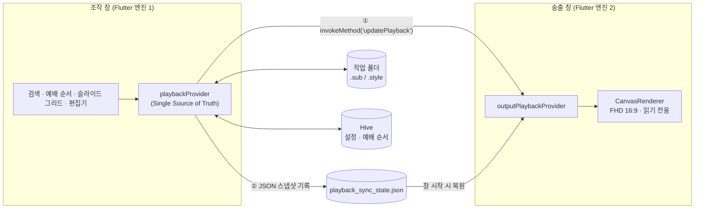

<div align="center">



# 주원 송출 (Joowon Subtitle)

**교회 예배용 찬양 가사 송출 데스크톱 앱**

예배 중 찬양 가사를 프로젝터·TV에 송출하고, 송출 담당자가 곡 검색·예배 순서·슬라이드 편집을 한 화면에서 처리하는 Flutter Desktop 애플리케이션

[](https://github.com/ha00h/joowon_subtitle/releases/latest)
[](https://github.com/ha00h/joowon_subtitle/actions/workflows/test.yml)


[다운로드](https://github.com/ha00h/joowon_subtitle/releases/latest) · [기술 문서](docs/README.md)

</div>

---

## 프로젝트 소개

### 배경

교회 예배에서는 찬양 가사를 대형 화면에 띄우기 위해 PPT나 범용 프레젠테이션 도구를 사용해 왔습니다. 하지만 실제 운영에서는 다음과 같은 불편이 반복되었습니다.

- 곡마다 PPT 파일이 흩어져 있어 **검색·재사용이 어렵다**
- 예배 순서가 바뀌면 파일을 다시 열고 닫아야 한다
- 글꼴·위치·색 등 **스타일을 곡마다 따로 맞춰야** 한다
- 송출 화면과 조작 화면이 분리되지 않아 **실수가 회중에게 그대로 노출**된다
- 영상 스위처의 Luma Key 합성을 위한 **검정 배경 송출**이 번거롭다

주원 송출은 이 문제를 해결하기 위해 **실제 교회 송출 PC(Windows, 3모니터 환경)** 를 대상으로 기획부터 배포·현장 피드백 반영까지 진행한 프로젝트입니다.

### 한 줄 정의

> 찬양 가사를 `.sub` 파일로 관리하고, `.style`로 스타일을 통일하며, 예배 순서대로 FHD 16:9 슬라이드를 선택한 모니터에 송출하는 데스크톱 앱

### 프로젝트 정보

| 항목 | 내용 |
|------|------|
| 개발 기간 | 2026.06 ~ (운영 중) |
| 개발 인원 | 1인 (기획·설계·개발·배포) |
| 최신 버전 | v1.1.2 ([릴리스 노트](https://github.com/ha00h/joowon_subtitle/releases)) |
| 대상 환경 | Windows 10/11 교회 송출 PC (운영), macOS (개발) |
| 규모 | Dart 약 11,000줄 · 테스트 78개 · 릴리스 9회 |

---

## 화면 구성

### 조작 화면

왼쪽에서 찬양을 검색하고 예배 순서를 구성하면, 오른쪽 슬라이드 그리드에 순서 전체가 곡 단위로 이어서 표시됩니다. 상단 툴바에서 송출 On/Off·검정 화면·가져오기·편집·스타일을, 하단 바에서 슬라이드 이동과 그리드 열 수를 조절합니다.



### 편집기 · 스타일 · 설정

| 캔버스 편집기 | 스타일 화면 |
|:---:|:---:|
|  |  |
| 1920×1080 캔버스에서 슬라이드별 폰트·색·정렬·외곽선·절 표기를 직접 편집 | `.style` 파일로 배경·본문 영역·절 표기 위치와 글꼴을 정의해 모든 곡에 일괄 적용 |

| 설정 화면 |
|:---:|
|  |
| 작업 폴더·활성 스타일·송출 모니터·송출 배경(검정 Luma Key / 투명 Alpha)·업데이트 확인 |

---

## 주요 기능

### 예배 운영

- **2창 구조** — 조작 창(송출 담당자용)과 송출 창(회중용 FHD 전체화면)을 분리
- **멀티 모니터** — 설정에서 송출 모니터를 선택하면 해당 모니터에 전체화면으로 배치
- **예배 순서** — 개수 제한 없이 저장, 드래그앤드롭으로 곡 추가·정렬, 곡·슬라이드 경계를 자연스럽게 넘김
- **키보드 중심 조작** — 방향키·Space·Page Up/Down·숫자+Enter 점프·`B` 빈 화면 토글 (Windows 숫자패드 지원)
- **송출 안정성** — 송출 창이 닫히면 빈 화면 상태로 자동 재연결, 송출 화면에서 마우스 커서 숨김
- **검정/투명 배경** — 영상 스위처 Luma Key 합성을 위한 검정 배경 기본, 투명(Alpha) 배경 옵션

### 가사·스타일 편집

- **`.txt` → `.sub` 가져오기** — 빈 줄 기준 슬라이드 자동 분리, 클립보드 붙여넣기 지원
- **새찬송가 645곡 내장 변환** — 절(1절·후렴) 자동 인식, 절 표기를 본문과 분리해 송출
- **캔버스 편집기** — 1920×1080 기준 텍스트·도형·이미지 배치, Undo/Redo, 자동 저장
- **`.style` 전역 스타일** — 글꼴·크기·색·외곽선·위치를 파일 단위로 정의해 모든 곡에 일괄 적용, 슬라이드별 override 가능
- **슬라이드 → 스타일 저장** — 편집한 슬라이드의 모양을 새 `.style`로 저장
- **슬라이드 컬러 태그** — 슬라이드 그리드에서 색으로 구간 구분

### 배포·유지보수

- **GitHub Actions 자동 릴리스** — `v*` 태그 push 시 Windows·macOS 빌드 후 GitHub Release에 zip 업로드
- **업데이트 알림** — 앱 시작 시 GitHub Releases API로 새 버전을 확인하고 다운로드 안내

---

## 기술 스택

| 분류 | 사용 기술 |
|------|----------|
| 프레임워크 | Flutter 3.44 Desktop (Windows, macOS), Dart 3.12 |
| 상태 관리 | Riverpod 3 (`Notifier` / `NotifierProvider`) |
| 로컬 저장소 | Hive (설정·예배 순서), JSON 파일 (`.sub`, `.style`, 창 간 동기화) |
| 윈도우 | `desktop_multi_window` (멀티 엔진 창), `window_manager`, `screen_retriever` |
| 네이티브 | Swift (macOS Security-Scoped Bookmark 플러그인) |
| 업데이트 | GitHub Releases API, `package_info_plus`, `pub_semver`, `url_launcher` |
| CI/CD | GitHub Actions (macOS 테스트, Windows 빌드, 태그 기반 릴리스) |

---

## 아키텍처



| 레이어 | 위치 | 역할 |
|--------|------|------|
| Models | `lib/models/` | `.sub`·`.style`·슬라이드 요소 JSON 직렬화, 하위 호환 |
| Services | `lib/services/` | 파서, 파일 I/O, 작업 폴더 스캔, 창 동기화, 업데이트 확인 |
| Repositories | `lib/repositories/` | Hive 기반 설정·예배 순서 영속화 |
| Providers | `lib/providers/` | Riverpod 상태 (재생·편집·순서·스타일·송출 창) |
| Windows | `lib/windows/` | 조작 화면, 송출 화면, 설정·스타일 화면 |
| Widgets | `lib/widgets/` | 캔버스 렌더러·편집기, 패널, 다이얼로그 |

자세한 설계는 [docs/ARCHITECTURE.md](docs/ARCHITECTURE.md)에 정리되어 있습니다.

---

## 기술적 도전과 해결

### 1. 별도 Flutter 엔진 간 실시간 상태 동기화

**문제** — `desktop_multi_window`로 만든 송출 창은 조작 창과 **메모리를 공유하지 않는 별도 Flutter 엔진**에서 실행됩니다. Riverpod 상태를 그대로 공유할 수 없고, Hive는 엔진마다 메모리 캐시가 분리되어 동기화 수단으로 쓸 수 없었습니다. 또한 송출을 껐다 켤 때마다 `WindowMethodChannel`을 새로 등록하면 채널 한도에 걸려 동기화가 끊겼습니다.

**해결** — 동기화 경로를 두 갈래로 나눴습니다.

- **즉시 반영:** 조작 창이 송출 창 컨트롤러에 `updatePlayback`을 직접 호출
- **복원용 스냅샷:** 매 변경을 JSON 파일로 기록하고, 송출 창이 새로 뜨면 마지막 상태를 읽어 즉시 복원
- 채널은 **조작 엔진에만 1회 등록**하고, 송출 엔진은 채널 등록 없이 스냅샷 + 직접 호출만 사용

결과적으로 송출 창이 재시작되거나 자동 재연결되어도 현재 슬라이드가 끊김 없이 이어집니다. (`playback_sync_service.dart`, `playback_sync_store.dart`)

### 2. macOS 개발 / Windows 운영 환경 분리

**문제** — 개발은 macOS에서 하지만 실제 운영은 교회의 Windows PC(3모니터 + 영상 스위처)입니다. 멀티 모니터 배치나 Windows 빌드는 Mac에서 직접 검증할 수 없었습니다.

**해결**
- 모니터 API를 사용할 수 없으면 **더미 모니터 목록으로 대체**해 Mac에서도 UI 흐름을 개발
- GitHub Actions의 `windows-latest` 러너로 **매 push마다 Windows 빌드**를 검증
- 태그 push 한 번으로 Windows·macOS 빌드 → GitHub Release 업로드까지 자동화
- 창 종료 처리도 OS별로 분기 (Windows는 `destroy`, macOS는 `close`)해 조작 창을 닫으면 송출 창이 함께 정리되도록 처리

### 3. macOS 샌드박스에서 사용자 폴더 접근 유지

**문제** — macOS App Sandbox에서는 사용자가 선택한 작업 폴더 접근 권한이 앱 재시작 시 사라집니다.

**해결** — Swift로 **Security-Scoped Bookmark 네이티브 플러그인**을 작성해 폴더 선택 시 북마크를 Hive에 저장하고, 앱 시작 시 복원해 재선택 없이 작업 폴더를 계속 사용할 수 있게 했습니다. (`macos/Runner/SecurityScopedAccess.swift`)

### 4. 해상도에 독립적인 캔버스 좌표계

**문제** — 편집기 미리보기, 슬라이드 썸네일, 실제 송출 화면의 크기가 모두 다르지만 같은 위치에 같은 모양으로 보여야 합니다. 초기에는 스타일 화면과 송출 렌더러의 위치 계산 규칙이 달라 결과가 어긋났습니다.

**해결** — 논리 해상도를 **1920×1080**으로 고정하고 요소 좌표를 **퍼센트(0–100)** 로 저장했습니다. 렌더링 시 실제 캔버스 크기로 환산하고, 스타일 화면·편집기·송출 렌더러가 같은 텍스트 박스 레이아웃 함수를 사용하도록 통일했습니다. (`canvas_text_layout.dart`, `canvas_renderer.dart`)

### 5. 스타일 우선순위 병합

`앱 기본값 → .style 파일 → 슬라이드 요소 override` 순서로 null이 아닌 필드만 덮어쓰는 병합 규칙을 두어, 전체 스타일을 한 번에 바꾸면서도 특정 슬라이드만 예외 처리할 수 있게 했습니다.

### 6. 키보드 단축키와 텍스트 입력의 공존

예배 중에는 키보드만으로 조작하지만, 같은 화면에 검색창도 있습니다. 모든 단축키 `Action`의 `isEnabled`에서 **텍스트 입력 포커스 여부를 검사**해, 검색어를 입력하는 동안에는 숫자·Space 키가 슬라이드를 넘기지 않도록 했습니다. (`operator_keyboard_shortcuts.dart`)

### 7. 대량 데이터 일괄 변환

새찬송가 645곡의 원문 텍스트를 `.sub`로 변환하는 스크립트를 작성해 `(1)`, `후렴:` 같은 절 구분을 자동으로 인식하고, 절 표기를 본문과 분리된 요소로 생성했습니다. (`dev/scripts/import_saechansongga.dart`)

---

## 사용자 피드백 기반 개선

v1.0 배포 후 실제 예배에서 받은 피드백 13건을 정리해 **우선순위 원칙**(송출 중단 버그 → 매주 반복되는 UX → 렌더링 기반 정비 → 표현 확장)에 따라 단계별로 반영했습니다. ([docs/PLAN_v1.1.md](docs/PLAN_v1.1.md))

| 버전 | 주요 내용 |
|------|----------|
| v1.0.0 | 첫 운영 배포, GitHub Releases 업데이트 알림 |
| v1.0.1 | "주원 송출"로 리브랜딩, 조작 흐름 개선 |
| v1.0.3 | 새찬송가 자막 내장, 검색·단축키 개선 |
| v1.1.0 | 절 표기, Windows 숫자패드, 패널 크기 조절, 컬러 피커·슬라이드 컬러 태그 |
| v1.1.1 | 예배 순서 스크롤 개선, 슬라이드 → 스타일 저장 |
| v1.1.2 | 앱 시작 시 송출 Off 상태로 시작 (예배 전 오송출 방지) |

---

## 단축키

| 키 | 동작 |
|----|------|
| `→` `↓` `Space` `Page Down` | 다음 슬라이드 (마지막이면 다음 곡) |
| `←` `↑` `Page Up` | 이전 슬라이드 |
| 숫자 + `Enter` | N번 슬라이드로 이동 (숫자패드 지원) |
| `B` | 빈 화면 토글 |
| `Home` | 첫 슬라이드 |
| `Delete` | 슬라이드 삭제 |

---

## 파일 형식

가사와 스타일은 사람이 읽을 수 있는 JSON 파일로 저장되어, 작업 폴더째 백업·공유할 수 있습니다.

```json
{
  "format": "joowon-subtitle",
  "version": 2,
  "title": "놀라운 은혜",
  "slides": [
    {
      "elements": [
        {
          "type": "text",
          "x": 50.0,
          "y": 50.0,
          "lines": ["놀라운 은혜", "어찌 이 은혜 잊을까"],
          "anchor": "center"
        }
      ]
    }
  ]
}
```

| 확장자 | 내용 |
|--------|------|
| `.sub` | 한 곡의 슬라이드 목록 (텍스트·도형·이미지 요소, 절 표기, 컬러 태그) |
| `.style` | 배경·글꼴·크기·색·외곽선·텍스트 영역 등 전역 스타일 |

---

## 시작하기

### 설치 (사용자)

[최신 릴리스](https://github.com/ha00h/joowon_subtitle/releases/latest)에서 OS에 맞는 zip을 내려받아 압축을 풀고 실행합니다.

### 개발 환경

```bash
flutter pub get
flutter run -d macos      # 또는 -d windows
```

### 테스트

```bash
flutter analyze
flutter test
```

모델 직렬화, 파서, 스타일 병합, 슬라이드 탐색, 창 동기화 저장소, 업데이트 확인, 단축키 등 78개의 단위·위젯·통합 테스트가 있으며 GitHub Actions에서 매 push마다 실행됩니다.

### 릴리스

```bash
# pubspec.yaml 버전 올린 뒤
git tag v1.2.0
git push origin v1.2.0
```

태그를 push하면 [release.yml](.github/workflows/release.yml)이 Windows·macOS 빌드를 만들어 GitHub Release에 올립니다. 자세한 절차는 [docs/RELEASE.md](docs/RELEASE.md)를 참고하세요.

---

## 업데이트 알림 동작

앱은 GitHub Releases API로 새 버전을 확인하고, zip 배포 방식에 맞게 **다운로드 페이지를 여는 소프트 알림**을 제공합니다. (자동 설치 없음)

| 항목 | 내용 |
|------|------|
| 현재 버전 | `pubspec.yaml` 버전을 `package_info_plus`로 읽음 |
| 최신 버전 | `GET /repos/ha00h/joowon_subtitle/releases/latest` |
| 비교 | `pub_semver`로 현재 버전과 릴리스 태그 비교 |
| 다운로드 | OS별 zip 링크(없으면 릴리스 페이지)를 브라우저로 열기 |

- 조작 창에서만 확인하며, 송출 창에는 어떤 알림도 띄우지 않음
- 앱 시작 후 4초 뒤 백그라운드에서 확인, 자동 확인은 24시간에 1회
- 다이얼로그에서 나중에 / 이 버전 건너뛰기 / 다운로드 선택
- 설정 → 앱 버전에서 수동 확인 가능
- 개발 중 테스트: `flutter run -d macos --dart-define=APP_VERSION_OVERRIDE=0.0.1`

---

## 프로젝트 구조

```
lib/
  constants/      # 브랜딩, 테마, 글꼴
  models/         # .sub, .style, 슬라이드 요소, 동기화 payload
  services/       # 파서, 파일 I/O, 폴더 스캔, 창 동기화, 업데이트
  repositories/   # Hive 영속화 (설정, 예배 순서)
  providers/      # Riverpod 상태 (playback/, order, style, output window …)
  windows/        # operator/ (조작·설정·스타일), output/ (송출)
  widgets/        # canvas/, editor/, panels/, dialogs/, common/
test/             # 단위·위젯·통합 테스트
dev/scripts/      # 새찬송가 일괄 변환 등 개발용 스크립트
docs/             # MVP 명세, 아키텍처, 개발 계획, 검증, 릴리스 문서
```

## 문서

| 문서 | 내용 |
|------|------|
| [MVP.md](docs/MVP.md) | 기능·범위·데이터 형식 명세 |
| [ARCHITECTURE.md](docs/ARCHITECTURE.md) | 모듈·상태·윈도우 구조 |
| [DEVELOPMENT_PLAN.md](docs/DEVELOPMENT_PLAN.md) | Phase·마일스톤·작업 분해 |
| [PLAN_v1.1.md](docs/PLAN_v1.1.md) | 현장 피드백 기반 v1.1 계획 |
| [VERIFICATION.md](docs/VERIFICATION.md) | 테스트·수용 검증 방법 |
| [RELEASE.md](docs/RELEASE.md) | 릴리스 절차 |
